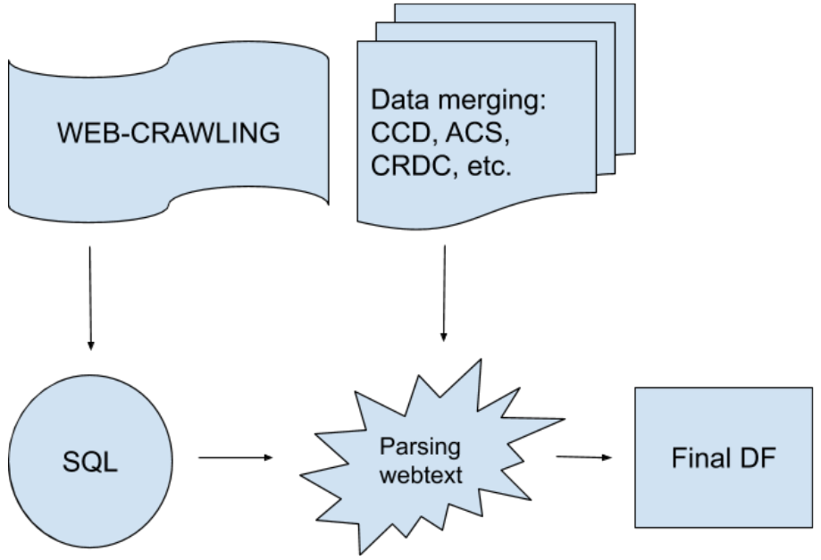

# data_management
Code for managing large data sets in Python, usually with Pandas. These scripts mostly merge, filter, inspect, and count things. Developed for a charter school database of 10K+ units based on web-crawling and federal data sources (CCD, ACS, etc).

List of data sources:
- [Web data collected by author & URAP team](https://github.com/jhaber-zz/web_tools)
- [Common Core of Data (CCD) Public School Universe Survey](https://nces.ed.gov/ccd/pubschuniv.asp)
- [American Community Survey (ACS)](https://www.census.gov/programs-surveys/acs) [(interactive)](https://factfinder.census.gov/)
- [EdFacts Achievement Results](https://www2.ed.gov/about/inits/ed/edfacts/data-files/index.html)
- [Civil Rights Data Collection (CRDC)](https://www2.ed.gov/about/offices/list/ocr/data.html)
- [Partisan Voting Index (PVI)](https://cookpolitical.com/pvi-0)

Overview of data generation workflow:

